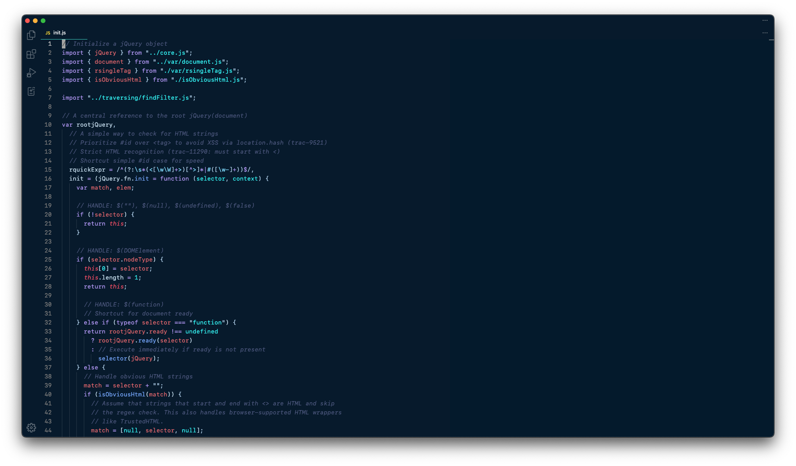
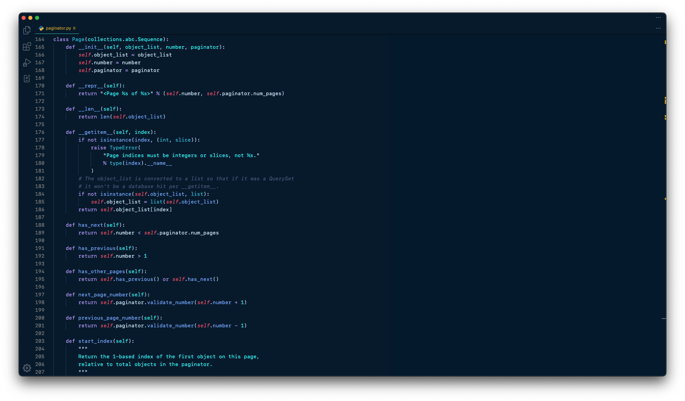

# Azulino

> **Azulino** (adjective) – Bluish, having a slight or soft blue hue.

A VS Code theme inspired by [@josean-dev](https://github.com/josean-dev)'s "coolnight" Neovim theme.

## Screenshots

### Javascript Example

### Python Example

